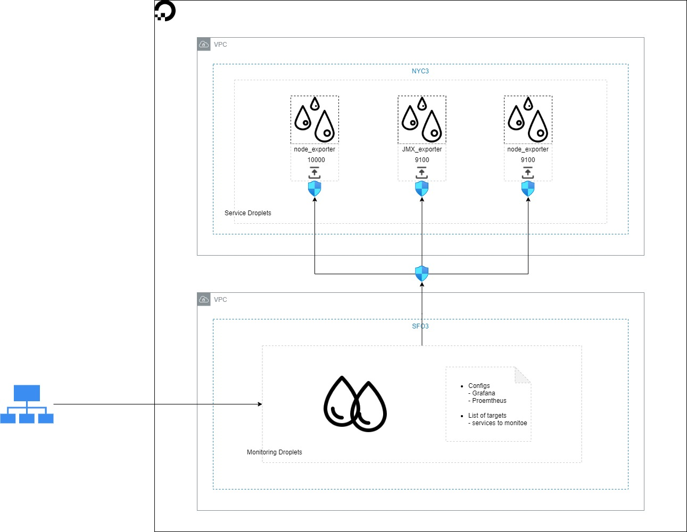

### Scope
This page gives a high-level design of monitoring setup for FulcrumSaaS application/resources deployed on DO cloud.

### Definitions

* Droplets - compute resource provided by DO

* Firewall - network firewall attached to a Droplet in which we can add Inbound/Outbound rules to allow certain ports

* NYC/SFO - the geographic region of DO datacentre

* Service - term service refers FulcrumSaaS Applications running on Droplets 

### Architectural Diagram

### Current Profile

* The monitoring stack consists of a single node Prometheus+Grafana setup. The monitoring node has been set up in a separate VPC.

    * Specs,

    * 2 vCPUs, 4 GB Memory, 80 GB Storage

    
    * Tags,

    * opsgrafanaprometheusmonitoring

    
    * Firewall

    * Allow port 443 from all for Grafana

    * Allow SSH from all

    

    
* Exporters have been installed on the FulcrumSaaS application servers,

    * Exporters,

    * node_exporter - 9100

    
    * Tags

    * <env> <service> <exporter>, Ex. stgnode_exporterweb

    
    * Firewall

    * Allow exporter port from  **monitor**  host

    

    
* Access

|  **Service**  |  **Endpoint**  |  **Port**  | 
|  --- |  --- |  --- | 
| Grafana | [https://ops-v1-grf.fulcrumsaas.net/](https://ops-v1-grf.fulcrumsaas.net/) | 443 | 
| Prometheus | [http://ops-v1-grf.fulcrumsaas.net:9090/](http://ops-v1-grf.fulcrumsaas.net:9090/) | 9090 | 

*****

[[category.storage-team]] 
[[category.confluence]] 
